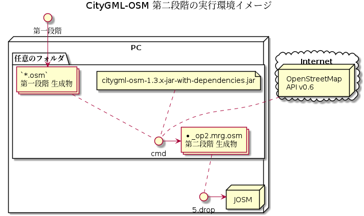

# CityGML

CityGMLから、OpenStreetMapへのJOSM用のOSMデータを生成する


## 生成物の例

- 第一段階生成ファイル: [53392547_bldg_6697_op2.osm](53392547_bldg_6697_op2.osm) ... CityGMLファイルからOSMファイルへ変換

- 第二段階生成ファイル: [53392547_bldg_6697_op2.mrg.osm](53392547_bldg_6697_op2.mrg.osm) ... 既存のOSMデータとマージしたOSMファイル


# Release

- 2021-05-16 リリース v1.2.8 / [citygml-osm v1.2.8](https://github.com/yuuhayashi/citygml-osm/releases/download/v1.2.8/citygml-osm-1.2.8-jar-with-dependencies.jar)<br/>Issue #18<br/>既存POIとのマージ機能を強化

- 2021-05-08 リリース v1.2.7 / [citygml-osm v1.2.7](https://github.com/yuuhayashi/citygml-osm/releases/download/v1.2.7/citygml-osm-1.2.7-jar-with-dependencies.jar)<br/>Issue #13 ／ 「箱根町」の `bldg:lod0FootPrint`(床形状)に対応<br/>Issue #13 ／ `bldg:lod0RoofEdge`が存在する場合は`bldg:lod0RoofEdge`を建物形状とする<br/>Issue #16 / `bldg:lod0FootPrint`を建物形状とした場合には`bldg:measuredHeight`を`osm:{building:height}`にする<br/>Issue #16 / `bldg:lod0FootPrint`を建物形状とした場合には`gml:posList`の高度を`osm:{building:ele}`にする

- 2021-05-08 リリース v1.2.6 / [citygml-osm v1.2.6](https://github.com/yuuhayashi/citygml-osm/releases/download/v1.2.6/citygml-osm-1.2.6-jar-with-dependencies.jar)<br/>Issue #12 ／ [単独の建物でもbuilding:part](https://github.com/yuuhayashi/citygml-osm/issues/12)<br/>マルチスレッド対策： 複合ビルディングなどで"building:part"が統合されたり、されなかったりする問題を解決しました。

- 2021-05-07 リリース v1.2.5 / [citygml-osm v1.2.5]<br/>Issue #12 ／ [単独の建物でもbuilding:part](https://github.com/yuuhayashi/citygml-osm/issues/12)

- 2021-05-05 リリース v1.2.4 / [citygml-osm v1.2.4]<br/>Issue #10 ／ 「箱根町」のデータファイル名に対応した。

- 2021-05-05 リリース v1.2.3 / [citygml-osm v1.2.3]<br/>第一段階（OSMへの変換）／複数の建物が接触している場合の変換に対応した。

- 2021-04-18 リリース v1.2.2 / [citygml-osm v1.2.2]<br/>既存データとの重複をチェックして、既存データと重複する場合には既存データを修復する。

- 2021-04-11 リリース v0.2.0 fixed #7 / [citygml-osm v0.2.0]<br/>JOSMと同じ"Java8"で実行可能

- 2021-04-10 リリース v0.1.1 [citygml-osm v0.1.1]
- 2021-04-10<br/> "source='MLIT_PLATEAU'"<br/>"source:name='http://www.opengis.net/def/crs/EPSG/0/6697'"
- 2021-04-10<br/> fixed #3 / 自治体コード「全国地方公共団体コード」を"addr:ref"としてタグ付け 
- 2021-04-10<br/> fixed #7 / 'relasion'メンバーのタグを"building=yes"に修正<br/>"outline"-> "building" には "height"をつけない
- 2021-04-10<br/> fixed #5 / 「bouns」を復活
- 2021-04-10<br/> fixed #4 / ロール「outlineがありません（警告）」を解決
- 2021-04-08<br/> fixed #1 / Issue#1を解決<br/> 接触した建物はリレーション building:part=yes にまとめる、単独の建物は buildhing=yes にする
- 2021-04-05<br/> fixed #2 / Issue#2を解決
- 2021-04-04<br/> リリース: 'citygml-osm v0.0.4'


# 使い方

## 第一段階


- (1) [GitHub-Release](https://github.com/yuuhayashi/citygml-osm/releases) から 'jar-with-dependencies' を'任意のフォルダ'にダウンロードする<br/> `citygml-get-x.x.x-jar-with-dependencies.jar` がダウンロードされます
  - [GitHub](https://github.com/yuuhayashi/citygml-osm)の右側にある「[Release](https://github.com/yuuhayashi/citygml-osm/releases)」欄から最新'Latest'版をダウンロードしてください

- (2) [オープンデータ公開サイト](https://www.geospatial.jp/ckan/dataset/plateau)から「3D都市データ」をダウンロードする

- (3) ダウンロードしたZIPファイルを'任意のフォルダ'に解凍する。<br/>ファイル末尾が「*_op2.gml」のファイルをため置きます。

- (4) コマンドターミナルから実行<br/>「*_op2.osm」ファイルが生成される

  ```
  $ cd (解凍先フォルダ)
  $ java -jar citygml-osm-1.2.4-jar-with-dependencies.jar
  ```

- (5) JOSMを起動して、「*.osm」ファイルをJOSMにドロップしてください。<br/>生成されたデータを確認することができます。


## 第二段階



- (1) [Github citygml-osm](https://github.com/yuuhayashi/citygml-osm) から 'docker-compose.yml' と 'osmdb.properties' を'任意のフォルダ'にダウンロードする

- (2) 'docker-compose'コマンドで'PostGIS'サーバを起動する<br/>※ 事前に「Docker」環境を用意しておく

  ```
  $ docker-compose up -d
  ```

- (3) コマンドターミナルから実行<br/>「*_op2.mrg.osm」ファイルが生成される

  ```
  $ cd (解凍先フォルダ)
  $ java -cp citygml-osm-1.2.2-jar-with-dependencies.jar osm.surveyor.osm.update.OsmUpdater
  ```

- (4) JOSMを起動して、「*_op2.mrg.osm」ファイルをJOSMにドロップしてください。<br/>生成されたデータを確認することができます。


**絶対にOSMへの「アップロード」は実行しないこと！！**

**確認のみ！！  確認し終わったら破棄すること！！**


# データフォーマット変換

## CityGMLフォーマット


「3D都市モデル」から読み取る項目

| 項目		| GMLタグ			| 説明											|
| --------	| ----------------- | -------------------------------------------	|
| データ範囲	| `gml:boundedBy`	| データ対象範囲									|
| ソース名	| `gml:Envelope`-`srsName`	| データソース名称						|
| 建築物		| `bldg:Building`	| ビルディングPOIに相当								|
| 屋根外形	| `bldg:lod0RoofEdge`	| 建築物の屋根形状								|
| 接地面		| `bldg:lod0FootPrint` | 建築物の床形状								|
| 建築物形状	| `bldg:lod1Solid`	| 建築物の形状を示す立体							|
| ID		| `gml:id`			| GMLでの管理ID									|
| 名称		| `gml:name`		| 重要な建物にのみ設定されている						|
| 建物ID		| `gen:stringAttribute`-`name="建物ID"`	| 建築物に付与された識別ID	|
| 自治体コード	| `gen:stringAttribute`-`name="13_*"`	| "13_区市町村コード_大字・町コード_町・丁目コード" |
| 計測高さ	| `bldg:measuredHeight`	| 地盤面からの建築物の高さ(m)				|
| 住所		| `xAL:LocalityName`-`Type="Town"`	| 							|

- **建築物**<br/>「建物POI」に相当する。

	- **屋根外形**<br/>形状には外郭線（`gml:exterior`）と内線(`gml:interior`)があり、'[{緯度、経度、高度}]'で表される<br/>'高度'は*屋根の標高*を表す

	- **接地面**<br/>形状には外郭線（`gml:exterior`）と内線(`gml:interior`)があり、'[{緯度、経度、高度}]'で表される<br/>'高度'は建物床の*標高*を表す

	- **建築物形状**<br/>建築物の水平的な位置を示す面に、一律の高さを与えた立体。'[{緯度、経度、高度}]'で表される<br/>'高度'は立体面の*標高*を表す。この標高から建築物の「最低標高=`ele`」と「最高標高」を取得して「建物の`height`＝（最高標高）ー（最低標高）」を算出する。

	- **計測高さ**<br/>計測により取得した建築物の地上の最低点から最高点までの高さ(m)。

その他、仕様には記載されているがデータで確認が取れないもの

- 「分類 `bldg:class`」 建築物の形態による区分 --> コードリスト: 'Building_class.xml'

- 「用途 `bldg:usage`」 建築物の主な使い道 --> コードリスト: 'Building_usage.xml'

- 「建築年 `bldg:yearOfConstruction`」 建築物が建築された年

- 「解体年 `bldg:yearOfDemolition`」 建築物が解体された年

- 「屋根の種別 `bldg:roofType`」 建築物の屋根形状の種類 --> 'Building_roofType.xml'

- 「地上階数 `bldg:storeysAboveGround`」 地上階の階数

- 「地下階数 `bldg:storeysBelowGround`」 地下階の階数

- 「`gen::stringAttribute 建物用途コード番号`」 --> コードリスト: 'Building_usageDetail.xml'


## "building" OSMフォーマットへの変換

### タグ付け

OSMファイルへの変換項目

| 項目		| エレメント			| 説明											|
| --------	| ----------------- | -------------------------------------------	|
| データ範囲	| `bounds`			| `maxlat`,`maxlon`,`minlat`,`minlon`		|

閉じたWAYへのタグ付け項目

| 項目		| GMLタグ					| 説明												|
| --------	| ------------------------- | -------------------------------------------		|
| ソース		| `k="source"`				| "MLIT_PLATEAU; " + **データソース名称** + **建物ID**	|
| 建物		| `k="building",v="yes"`	| リレーション:buildingのメンバーの場合は、`k="building:part",v="yes"`	|
| 建物名称	| `k="building:name"`		| リレーション:buildingのメンバーの場合は、`k="name"`		|
| 住所コード	| `k="addr:ref"`			| **自治体コード** ("13_区市町村コード_大字・町コード_町・丁目コード") 	|
| 住所		| `k="addr:full"`			| **住所**											|
| 建物高さ	| `k="height"`				| **計測高さ**`bldg:measuredHeight`, `bldg:measuredHeight`がない場合は、`lod1Solid`と`lod0[RoofEdge,FoodPrint`から算出する	|
| 標高		| `k="ele"`				| **建築物形状の高度**	`bldg:lod1Solid`の最低高度		|

- 建物名称 `k="building:name"`
	- 建物ポリゴン `Relation::type="multipolygon"` の場合は、`k="name"`とする
	- 建物リレーション `Relation::type="building"`の場合は、`k="name"`とする
	- 建物パーツ `member::role="part"`->`building=yes` の場合は、`k="name"`とする
	- 複合ビルの場合は、構成部位の名称のうちで、最も文字数が多いものを「合成名称」にする（Relation:`k="name"`の`v=合成名称`）

- 建物高さ `ele`
	- `bldg:lod1Solid`の'高度'値の最低値
	- 複合ビルの場合は、全ビルパーツの最低値

- 建物高さ `height`
	- `building:height`とはしない
	- 単体ビルの場合は、`bldg:measuredHeight`。
	- 単体ビルで、`bldg:measuredHeight`がない場合は、`lod1Solid`と`lod0[RoofEdge,FoodPrint`から算出する
	- 複合ビルの場合は、複合ビルの'最低標高'を求め、全ビルパーツの'最低標高'からの'高さ'の最大値。'標高'が設定されていないビルパーツは全ビルパーツの'最低標高’からの高さが設定されているとみなす。

### POI構成

「建物Way」の同士の接触状態によって、「連接ビルディング」や「マルチポリゴン」を形成する。

#### a. 単純ビルディング

他のビルディングと接触しないもの


一つのWAYのみで完結させる

- Step 1. parse GML file [sample-a-osm1](doc/building/sample-a/sample-a-osm1.png)

- Step 2. 接触しているBUILDINGのWAYをくっつけて"Relation:building"をつくる (Step1から変化なし)

- Step 3. メンバーが一つしかないRelation:building を削除する [sample-a-osm3](doc/building/sample-a/sample-a-osm3.png)

- Step 4. Relation:building->member:role=port のWay:outlineを作成する
- Step 4. Relation:multipolygon->outerにWay:outline (Step3から変化なし)

- Step 5. 不要なPOIを削除する　(Step3から変化なし)


##### a-1. 線で接触していないビルディング

接触していないが他の建物のノードと共有しているパターン　[接点パターン](doc/building/sample-a/Sample-a-SharePoint.png)


#### b. 中空部を持つ単一ビルディング

中空部分('gml:interior')があるビルディングで、他のビルディングと接触しないもの


マルチポリゴン・リレーションでビルディングを描く

- Step 1. parse GML file [sample-b-osm1.png](doc/building/sample-b/sample-b-osm1.png)

- Step 2. 接触しているBUILDINGのWAYをくっつけて"Relation:building"をつくる (Step1から変化なし)

- Step 3. Relation:building->member:role=port のWay:outlineを作成する

- Step 3. Relation:multipolygon->outerにWay:outline (Step1から変化なし)

- Step 4. メンバーが一つしかないRelation:building を削除する (Step1から変化なし)

- Step 5. 不要なPOIを削除する　[sample a OSM](doc/building/sample-b/sample-b-osm.pu.png)


#### c. 複数のビルディングが接触しているもの（連接ビルディング）

中空部分('gml:interior')がない建物同士が、接触しているもの。


ビルディング・リレーションを使って描く

- Step 1. parse GML file "[sample-c-osm1](doc/building/sample-c/osm1-parse.png)"

- Step 2. 接触しているBUILDINGのWAYを"Relation:building"にまとめる "[osm2 RelationMarge](doc/building/sample-c/osm2-RelationMarge.png)"

- Step 3. メンバーが一つしかないRelation:building を削除する "[osm3 RemoveSinglePart](doc/building/sample-c/osm3-RemoveSinglePart.png)"

- Step 4. Relation:building->member:role=port のWay:outlineを作成する

- Step 4. Relation:multipolygon->outerにWay:outline "[osm4 Create Outline](doc/building/sample-c/osm4-CreateOutline.png)"

- Step 5. 不要なPOIを削除する　"[sample a OSM](doc/building/sample-c/osm.pu.png)"


 

#### d. 中空部分がある連接ビルディング

他のビルディングと接触しているビルディングで、中空部分を含む場合。


ビルディング・リレーションのOutlineに、マルチポリゴン・リレーションを使って描く

- Step 1. parse GML file "[sample-D Parse](doc/building/sample-d/osm1-parse.png)"

- Step 2. 接触しているBUILDINGのWAYを"Relation:building"にまとめる "[osm2 RelationMarge](doc/building/sample-c/osm2-RelationMarge.png)"

- Step 3. メンバーが一つしかないRelation:building を削除する "[osm3 RemoveSinglePart](doc/building/sample-c/osm3-RemoveSinglePart.png)"

- Step 4. Relation:building->member:role=port のWay:outlineを作成する

- Step 4. Relation:multipolygon->outerにWay:outline "[osm4 Create Outline](doc/building/sample-c/osm4-CreateOutline.png)"

- Step 5. 不要なPOIを削除する　"[sample a OSM](doc/building/sample-c/osm.pu.png)"


- [中空部分がある複合ビルディングの書き方](doc/building/Building.md)


#### e. 空白部分がある連接ビルディング

連接ビルディングに囲まれた「空白」ができたもの


* "outline:way"(外郭線)を補完する
* "inner:way"（空白部分）をインナーラインとして補完する
* "name=..."の継承

- Step 1. parse GML file "[sample-D Parse](doc/building/sample-e/osm1-parse.png)"

- Step 2. 接触しているBUILDINGのWAYを"Relation:building"にまとめる "[osm2 RelationMarge](doc/building/sample-e/osm2-RelationMarge.png)"

- Step 3. メンバーが一つしかないRelation:building を削除する "[osm3 RemoveSinglePart](doc/building/sample-e/osm3-RemoveSinglePart.png)"

- Step 4. Relation:building->member:role=port のWay:outlineを作成する

- Step 4. Relation:multipolygon->outerにWay:outline "[osm4 Create Outline](doc/building/sample-e/osm4-CreateOutline.png)"

- Step 5. 不要なPOIを削除する　(変更なし)


### 既存POIとのオーバーラップ

#### pattern A-1

オーバーラップする既存WAYが存在しない場合

* 例: '13111-bldg-365'
* WAYを"action=modify"にする

#### pattern A-2

オーバーラップする既存WAYが存在する場合

* 例: '13111-bldg-466'
* WAYを"action=modify"にする
* WAY.IDを既存WAYのWAY.IDに変更する
* WAY.TAGsに既存WAY.TAGsを上書きする

	* この際に、既存WAY.TAGsに"height=*"があれば WAY.TAGの値は上書きされる
	* TAG "building"のvalue は、既存WAY.TAGの値に上書き
	* "source"TAGは WAYで書き換えられる。

* WAY.TAGsに"fixme=PLATEAUデータで更新されています"を追加

#### pattern A-3

オーバーラップする既存WAYが複数存在する場合

* 重なる面積が最大の既存WAYを'更新'する
* 他の重複する既存WAYは'削除'する。'fixme=PLATEAUデータで置き換えられました'


------

## 内部資料

- [クラス関連図](doc/citygml/class.png)

- [データベース テーブル 関連図](doc/citygml/dbTables.png)

- 第二段階 [OsmUpdater](doc/OsmUpdater/README.md)

----------------

## 関連サイト

 - [OpenStreetMap Wiki - MLIT_PLATEAU](https://wiki.openstreetmap.org/wiki/MLIT_PLATEAU)

 - [210327PLATEAUを触ってみよう](https://hackmd.io/@geopythonjp/HkZOmNpqL/%2FhfZTkl5FQGy8YHrgzc7ohQ)

 - [オープンデータ公開サイト](https://www.geospatial.jp/ckan/dataset/plateau)

 - [GitHub yuuhayashi/citygml-osm](https://github.com/yuuhayashi/citygml-osm)

 - [中空部分がある複合ビルディングの書き方](doc/building/Building.md)

 - [JA:基本的な3Dの建物](https://wiki.openstreetmap.org/wiki/JA:%E5%9F%BA%E6%9C%AC%E7%9A%84%E3%81%AA3D%E3%81%AE%E5%BB%BA%E7%89%A9)
 
 - [JA:Relation:multipolygon](https://wiki.openstreetmap.org/wiki/JA:Relation:multipolygon)
 
 - [osmbuilding 東京駅](https://osmbuildings.org/?lat=35.62651&lon=139.77533&zoom=17.0&tilt=45&rotation=109)

