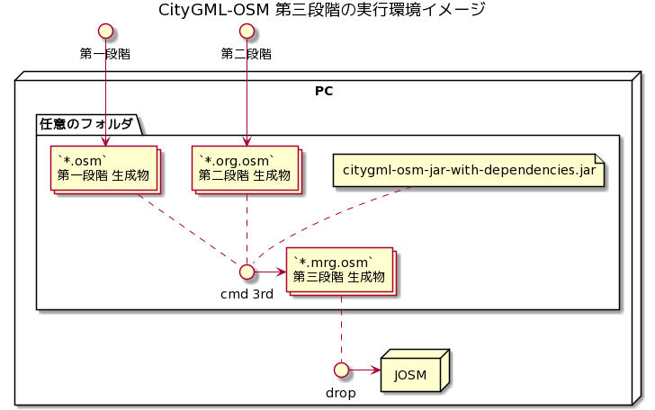
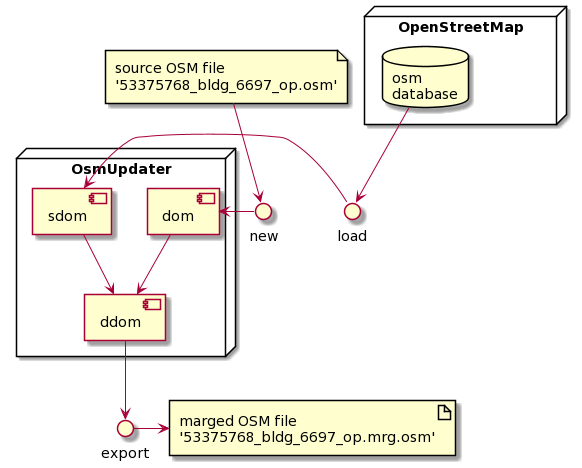

# OsmUpdater

「`xxxx.org.osm`」と「OSMファイル」を比較して、既存buildingと重複するデータは、既存データを更新します。



- (1) コマンドターミナルから実行<br/>「`*.mrg.osm`」ファイルが生成される

```
  $ cd (解凍先フォルダ)
  $ java -cp citygml-osm-jar-with-dependencies.jar osm.surveyor.update.OsmUpdater
```

- (2) JOSMを起動して、「`*.mrg.osm`」ファイルをJOSMにドロップしてください。<br/>生成されたデータを確認することができます。


