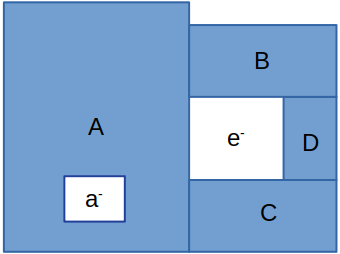
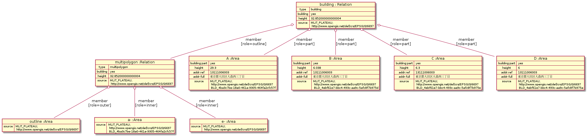

# 中空部分を持つ建物の書き方

- 「A」「B」「C」「D」の４つの建物部位で構成される建物
- 「a~」は、「A」の中空部分
- 「e~」は、「A」「B」「C」「D」で囲まれた空白部分

## (1) 全体を Maltipolygon にする

まずはじめに、建物部位全体を囲む **outline** と、中空部分／空白部分をメンバーに持つ **Relation:Multipolygon** を作成する。

- 輪郭線や、中空エリアにはタグ付けしない。
- 輪郭線のロールは 'outer'
- 中空エリア、空白エリアのロールは、'inner'

## (2) "building :リレーション" を作る

- 先程作成した multipolygon をメンバー登録[role=outline]する
- 構成する建物部位をメンバー登録[role=part]する

----

### 参考

 - [JA:基本的な3Dの建物](https://wiki.openstreetmap.org/wiki/JA:%E5%9F%BA%E6%9C%AC%E7%9A%84%E3%81%AA3D%E3%81%AE%E5%BB%BA%E7%89%A9)
 
 - [JA:Relation:multipolygon](https://wiki.openstreetmap.org/wiki/JA:Relation:multipolygon)

